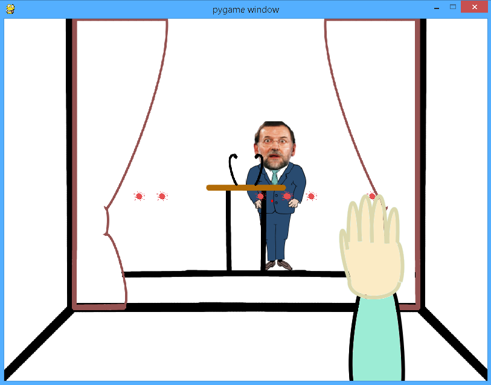

#Game: Tomatéale. Work in progress
##Python and Pygame module

Things to do:

- Make collision between tomatoes and rectangle (actor). Draw smashed tomatoes onto actor's surface
- States and randomize actions.
- Posibility of make y-axis movements
- Life and points counter
- Finish pictures design
