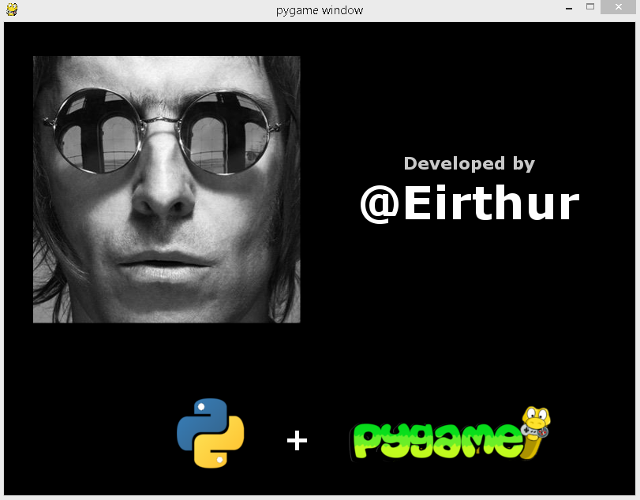
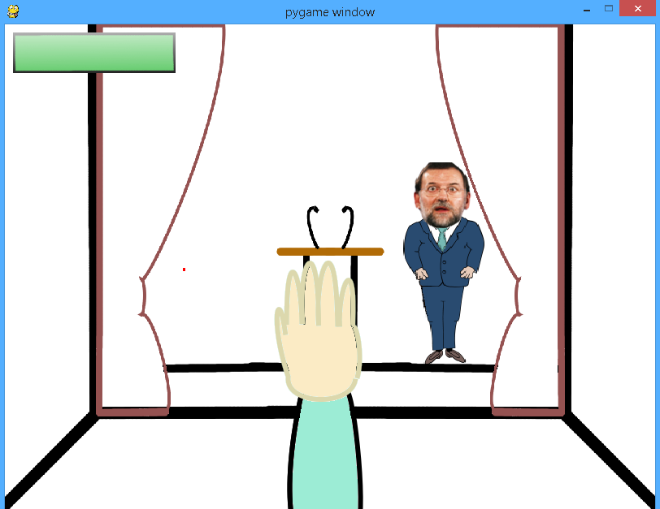

#Game: Tomatéale. Work in progress
##Python and Pygame module

###Super cool intro:

###Screenshot:

Things to do:

- Draw smashed tomatoes onto actor's surface
- Posibility of make y-axis movements
- Finish pictures design
