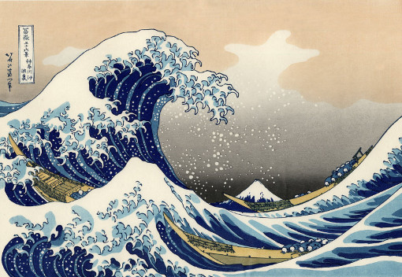
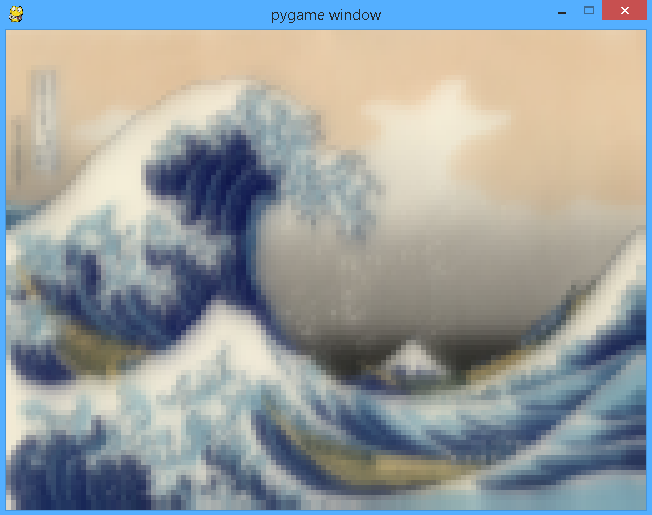
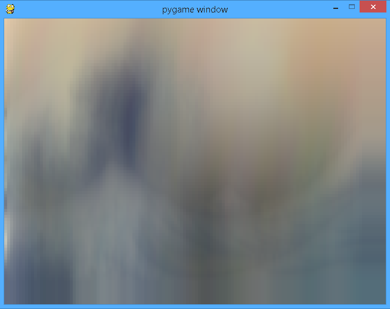

##Manipulación de arrays de píxeles obtenidos de imágenes en Pygame

#Imagen original

#Colores oscuros
    from pygame import *
    from pygame.locals import *
    
    ventana = pygame.display.set_mode((640,480))
    imagen = pygame.transform.scale(pygame.image.load("img.jpg"),(640,480))
    arra = pygame.PixelArray(imagen)
    nuevo = pygame.PixelArray(imagen)
    ventana.blit(nuevo.make_surface(),(0,0))
    pygame.display.update()
    ventana_2 = pygame.display.set_mode((640,480))
    for x in range(640):
    	for y in range(480):
    		if (y+1)<480:
    			RGBint = nuevo[x][y]
    			Blue =  RGBint & 255
    			Green = (RGBint >> 8) & 255
    			Red =   (RGBint >> 16) & 255
    			Rg = int((Blue + Green + Red)*255/765)
    			#print Rg
    			if (Blue<120 and Red<120 and Green<120):
    				nuevo[x][y] = (Red,Green,Blue)
    			else:
    				nuevo[x][y] = (255,255,255)
    ventana_2.blit(nuevo.make_surface(),(0,0))
    print "Realizado"
    while True:
    	for event in pygame.event.get():
    		if event.type == pygame.QUIT:
    			exit()
    	pygame.display.update()

#Transformación a Blanco y Negro
    import pygame
    from pygame.locals import *
    
    ventana = pygame.display.set_mode((640,480))
    imagen = pygame.transform.scale(pygame.image.load("img.jpg"),(640,480))
    arra = pygame.PixelArray(imagen)
    nuevo = pygame.PixelArray(imagen)
    ventana.blit(nuevo.make_surface(),(0,0))
    pygame.display.update()
    ventana_2 = pygame.display.set_mode((640,480))
    for x in range(640):
    	for y in range(480):
    		if (y+1)<480:
    			RGBint = nuevo[x][y]
    			Blue =  RGBint & 255
    			Green = (RGBint >> 8) & 255
    			Red =   (RGBint >> 16) & 255
    			Rg = int((Blue + Green + Red)*255/765)
    			#print Rg
    			nuevo[x][y] = (Rg,Rg,Rg)
    ventana_2.blit(nuevo.make_surface(),(0,0))
    print "Realizado"
    while True:
    	for event in pygame.event.get():
    		if event.type == pygame.QUIT:
    			exit()
    	pygame.display.update()

#Blanco y negro invertido

    import pygame
    from pygame.locals import *
    
    ventana = pygame.display.set_mode((640,480))
    imagen = pygame.transform.scale(pygame.image.load("img.jpg"),(640,480))
    arra = pygame.PixelArray(imagen)
    nuevo = pygame.PixelArray(imagen)
    ventana.blit(nuevo.make_surface(),(0,0))
    pygame.display.update()
    ventana_2 = pygame.display.set_mode((640,480))
    for x in range(640):
    	for y in range(480):
    		if (y+1)<480:
    			RGBint = nuevo[x][y]
    			Blue =  RGBint & 255
    			Green = (RGBint >> 8) & 255
    			Red =   (RGBint >> 16) & 255
    			Rg = 255-int((Blue + Green + Red)*255/765)
    			#print Rg
    			nuevo[x][y] = (Rg,Rg,Rg)
    ventana_2.blit(nuevo.make_surface(),(0,0))
    print "Realizado"
    while True:
    	for event in pygame.event.get():
    		if event.type == pygame.QUIT:
    			exit()
    	pygame.display.update()

#Imagen diferencial respecto a coordenadas horizontales

    import pygame
    from pygame.locals import *
    
    ventana = pygame.display.set_mode((640,480))
    imagen = pygame.transform.scale(pygame.image.load("img.jpg"),(640,480))
    arra = pygame.PixelArray(imagen)
    nuevo = pygame.PixelArray(imagen)
    ventana.blit(nuevo.make_surface(),(0,0))
    pygame.display.update()
    ventana_2 = pygame.display.set_mode((640,480))
    for x in range(640):
    	for y in range(480):
    		if (x+1)<640:
    			RGBint = nuevo[x][y]
    			Blue =  RGBint & 255
    			Green = (RGBint >> 8) & 255
    			Red =   (RGBint >> 16) & 255
    			Rg = int((Blue + Green + Red)*255/765)
    			RGBint = nuevo[x+1][y]
    			Blue =  RGBint & 255
    			Green = (RGBint >> 8) & 255
    			Red =   (RGBint >> 16) & 255
    			Rg_fin = int((Blue + Green + Red)*255/765)
    			#print Rg
    			nuevo[x][y] = (abs(Rg_fin-Rg),abs(Rg_fin - Rg),abs(Rg_fin - Rg))
    ventana_2.blit(nuevo.make_surface(),(0,0))
    print "Realizado"
    while True:
    	for event in pygame.event.get():
    		if event.type == pygame.QUIT:
    			exit()
    	pygame.display.update()

#Imagen diferencial respecto a coordenadas verticales

    import pygame
    from pygame.locals import *
    
    ventana = pygame.display.set_mode((640,480))
    imagen = pygame.transform.scale(pygame.image.load("img.jpg"),(640,480))
    arra = pygame.PixelArray(imagen)
    nuevo = pygame.PixelArray(imagen)
    ventana.blit(nuevo.make_surface(),(0,0))
    pygame.display.update()
    ventana_2 = pygame.display.set_mode((640,480))
    for x in range(640):
    	for y in range(480):
    		if (y+1)<480:
    			RGBint = nuevo[x][y]
    			Blue =  RGBint & 255
    			Green = (RGBint >> 8) & 255
    			Red =   (RGBint >> 16) & 255
    			Rg = int((Blue + Green + Red)*255/765)
    			RGBint = nuevo[x][y+1]
    			Blue =  RGBint & 255
    			Green = (RGBint >> 8) & 255
    			Red =   (RGBint >> 16) & 255
    			Rg_fin = int((Blue + Green + Red)*255/765)
    			#print Rg
    			nuevo[x][y] = (abs(Rg_fin-Rg),abs(Rg_fin - Rg),abs(Rg_fin - Rg))
    ventana_2.blit(nuevo.make_surface(),(0,0))
    print "Realizado"
    while True:
    	for event in pygame.event.get():
    		if event.type == pygame.QUIT:
    			exit()
    	pygame.display.update()

#Producto del color
    import pygame
    from pygame.locals import *
    
    ventana = pygame.display.set_mode((640,480))
    imagen = pygame.transform.scale(pygame.image.load("img.jpg"),(640,480))
    arra = pygame.PixelArray(imagen)
    nuevo = pygame.PixelArray(imagen)
    ventana.blit(nuevo.make_surface(),(0,0))
    pygame.display.update()
    ventana_2 = pygame.display.set_mode((640,480))
    for x in range(640):
    	for y in range(480):
    			#RGBint = nuevo[x][y]
    			
    			nuevo[x][y] = nuevo[x][y]*2
    ventana_2.blit(nuevo.make_surface(),(0,0))
    print "Realizado"
    while True:
    	for event in pygame.event.get():
    		if event.type == pygame.QUIT:
    			exit()
    	pygame.display.update()

#Pixelización de la imagen: radio 2, en grises
    import pygame
    from pygame.locals import *
    
    ventana = pygame.display.set_mode((640,480))
    imagen = pygame.transform.scale(pygame.image.load("img.jpg"),(640,480))
    arra = pygame.PixelArray(imagen)
    nuevo = pygame.PixelArray(imagen)
    ventana.blit(nuevo.make_surface(),(0,0))
    pygame.display.update()
    ventana_2 = pygame.display.set_mode((640,480))
    rango = 2
    for x in range(0,640,5):
    	for y in range(0,480,5):
    		if (y-rango>=0 and y+rango<=480) and (x-rango>=0 and x+rango<=640):
    			c = 0
    			media = 0
    			for i in range(-rango,rango):
    				for j in range(-rango,rango):
    					c+=1
    					RGBint = nuevo[x+i][y+j]
    					Blue =  RGBint & 255
    					Green = (RGBint >> 8) & 255
    					Red =   (RGBint >> 16) & 255
    					Rg = int((Blue + Green + Red)*255/765)
    					media += Rg
    			#print Rg
    			Rg = int(media/c)
    			for i in range(-rango,rango):
    				for j in range(-rango,rango):
    					nuevo[x+i][y+j] = (Rg,Rg,Rg)
    ventana_2.blit(nuevo.make_surface(),(0,0))
    print "Realizado"
    while True:
    	for event in pygame.event.get():
    		if event.type == pygame.QUIT:
    			exit()
    	pygame.display.update()

#Pixelización de la imagen: radio 5, en grises
    import pygame
    from pygame.locals import *
    
    ventana = pygame.display.set_mode((640,480))
    imagen = pygame.transform.scale(pygame.image.load("img.jpg"),(640,480))
    arra = pygame.PixelArray(imagen)
    nuevo = pygame.PixelArray(imagen)
    ventana.blit(nuevo.make_surface(),(0,0))
    pygame.display.update()
    ventana_2 = pygame.display.set_mode((640,480))
    rango = 5
    for x in range(0,640,5):
    	for y in range(0,480,5):
    		if (y-rango>=0 and y+rango<=480) and (x-rango>=0 and x+rango<=640):
    			c = 0
    			media = 0
    			for i in range(-rango,rango):
    				for j in range(-rango,rango):
    					c+=1
    					RGBint = nuevo[x+i][y+j]
    					Blue =  RGBint & 255
    					Green = (RGBint >> 8) & 255
    					Red =   (RGBint >> 16) & 255
    					Rg = int((Blue + Green + Red)*255/765)
    					media += Rg
    			#print Rg
    			Rg = int(media/c)
    			for i in range(-rango,rango):
    				for j in range(-rango,rango):
    					nuevo[x+i][y+j] = (Rg,Rg,Rg)
    ventana_2.blit(nuevo.make_surface(),(0,0))
    print "Realizado"
    while True:
    	for event in pygame.event.get():
    		if event.type == pygame.QUIT:
    			exit()
    	pygame.display.update()

#Pixelización de la imagen: radio 5, media de colores
	import pygame
	from pygame.locals import *
	
	ventana = pygame.display.set_mode((640,480))
	imagen = pygame.transform.scale(pygame.image.load("img.jpg"),(640,480))
	arra = pygame.PixelArray(imagen)
	nuevo = pygame.PixelArray(imagen)
	ventana.blit(nuevo.make_surface(),(0,0))
	pygame.display.update()
	ventana_2 = pygame.display.set_mode((640,480))
	rango = 5
	for x in range(0,640,5):
	for y in range(0,480,5):
		if (y-rango>=0 and y+rango<=480) and (x-rango>=0 and x+rango<=640):
			c = 0
			media = [0,0,0]
			for i in range(-rango,rango):
				for j in range(-rango,rango):
					c+=1
					RGBint = nuevo[x+i][y+j]
					Blue =  RGBint & 255
					Green = (RGBint >> 8) & 255
					Red =   (RGBint >> 16) & 255
					media[0] += Red
					media[1] += Green
					media[2] += Blue
			#print Rg
			media[0] = int(media[0]/c)
			media[1] = int(media[1]/c)
			media[2] = int(media[2]/c)
			for i in range(-rango,rango):
				for j in range(-rango,rango):
					nuevo[x+i][y+j] = media
	ventana_2.blit(nuevo.make_surface(),(0,0))
	print "Realizado"
	while True:
	for event in pygame.event.get():
		if event.type == pygame.QUIT:
			exit()
	pygame.display.update()

#Pixelización de la imagen: radio 20, en color

	import pygame
	from pygame.locals import *

	ventana = pygame.display.set_mode((640,480))
	imagen = pygame.transform.scale(pygame.image.load("img.jpg"),(640,480))
	arra = pygame.PixelArray(imagen)
	nuevo = pygame.PixelArray(imagen)
	ventana.blit(nuevo.make_surface(),(0,0))
	pygame.display.update()
	ventana_2 = pygame.display.set_mode((640,480))
	rango = 5
	for x in range(0,640,5):
	for y in range(0,480,5):
		if (y-rango>=0 and y+rango<=480) and (x-rango>=0 and x+rango<=640):
			c = 0
			media = [0,0,0]
			for i in range(-rango,rango):
				for j in range(-rango,rango):
					c+=1
					RGBint = nuevo[x+i][y+j]
					Blue =  RGBint & 255
					Green = (RGBint >> 8) & 255
					Red =   (RGBint >> 16) & 255
					media[0] += Red
					media[1] += Green
					media[2] += Blue
			#print Rg
			media[0] = int(media[0]/c)
			media[1] = int(media[1]/c)
			media[2] = int(media[2]/c)
			for i in range(-rango,rango):
				for j in range(-rango,rango):
					nuevo[x+i][y+j] = media
	ventana_2.blit(nuevo.make_surface(),(0,0))
	print "Realizado"
	while True:
	for event in pygame.event.get():
		if event.type == pygame.QUIT:
			exit()
	pygame.display.update()

