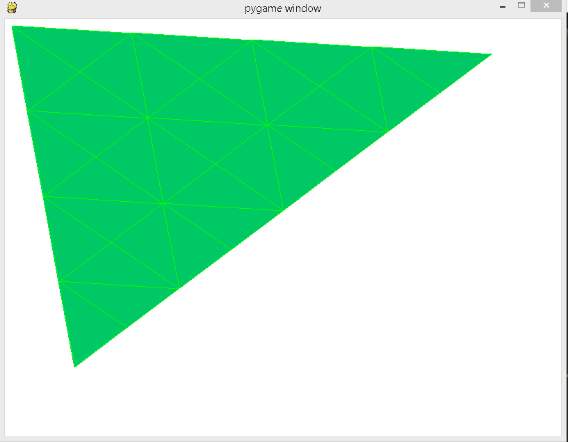
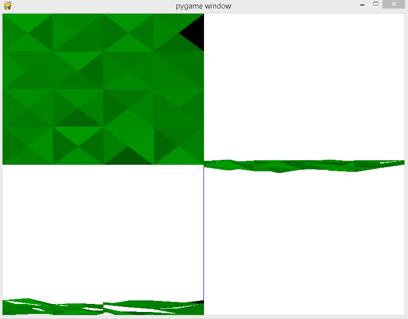

##Triangulación

###Puntos en 2D

###Puntos en 3D

La vista se divide en cuatro paneles aunque solamente se utilizan tres. El superior izquierdo representa la vista desde arriba ( X - Y), superior derecho la vista de frente ( X - Z) y el panel inferior se encarga de una vista inclinada basada en el anterior panel. Tenemos la variable: coeficiente, en la clase triángulo que se encargará de inclinar más ( > 0) o menos (~ 0) el ángulo de la cámara.

