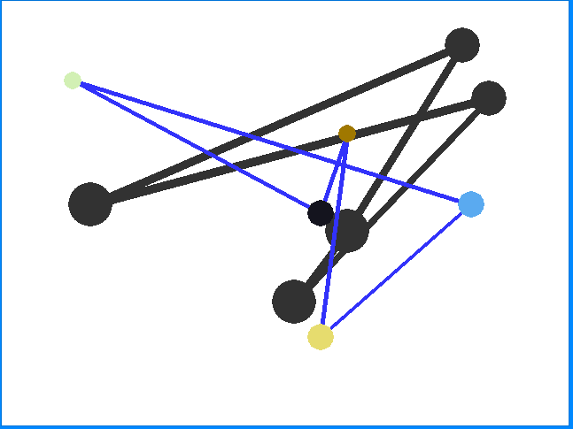

# BallsLogicGame
How many different balls can you put in the correct hole? They are conected, so it´s not so easy than you though.

If you want to play download the executable files and execute "inicio.vbs". Also you can download the source code and execute it (always with <b>Pygame</b> installed, <b>Python v. 2.7</b>)

Captured image:

